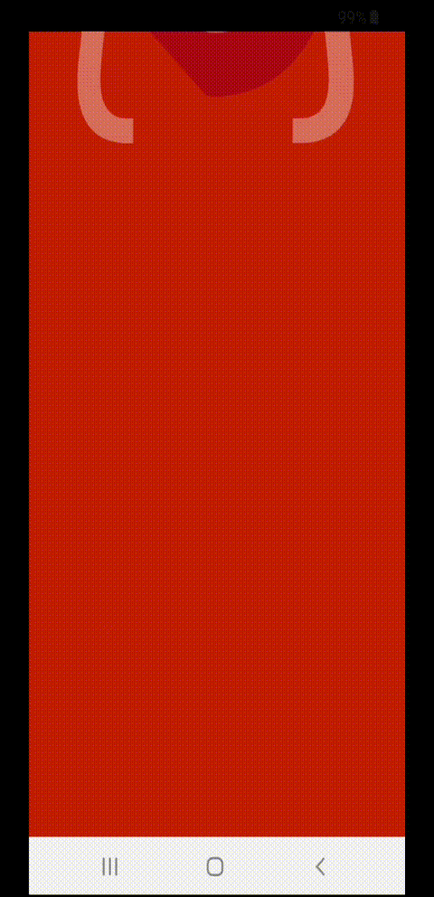
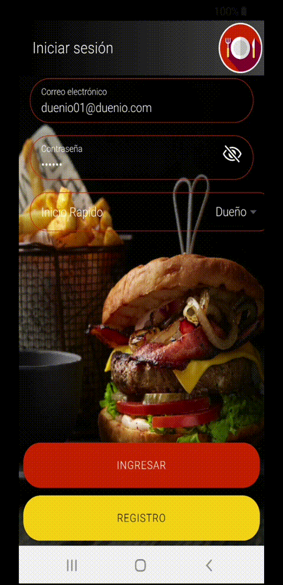

<h1 style="text-align:center"> :fork_and_knife: Grupo Ionic | La comanda :fork_and_knife: </h1>

 
	

<h4>Integrantes: </h4>
<ul>
  <li><a href="https://github.com/gilbertocp" style="font-size:22px">Gilberto Calderón (Alpha)</a></li>
  <li><a href="https://github.com/aubelelautaro" style="font-size:22px">Lautaro Aubele (Beta)</a></li>
  <li><a href="https://github.com/nicohnavarro"  style="font-size:22px">Nicolás Navarro (Gamma)</a></li>
<ul>
<table style="width:100%">
<thead>
  <th>SPLASH</th>
  <th>SPINNER</th>
</thead><tbody><tr><td style="text-align:center"></td><td  style="text-align:center"></td></tr></tbody></table>

# Sprint # 1 :pushpin:

#### GILBERTO CALDERÓN
* Alta empleados  - Completado :white_check_mark:
* Alta productos - Completado :white_check_mark:
* Qr ingreso local - En proceso :arrows_clockwise:

#### Nicolás Navarro
* Alta dueño / supervisor - Completado :white_check_mark:
* Qr propina - Completado :white_check_mark:

#### Lautaro Aubele
* Alta cliente - No completado :x:
* Alta mesa - No competado :x:
* Qr mesa - No completado :x:

#####  Tareas Secundarias Sprint #1 :clipboard:

#### GILBERTO CALDERÓN
* Splash Animado
* Spinner

#### Nicolás Navarro
* Estilos y Colores
* Diseño logo y splash

##### Motivo de la falta de Lautaro Aubele :interrobang:
* PC Dañada